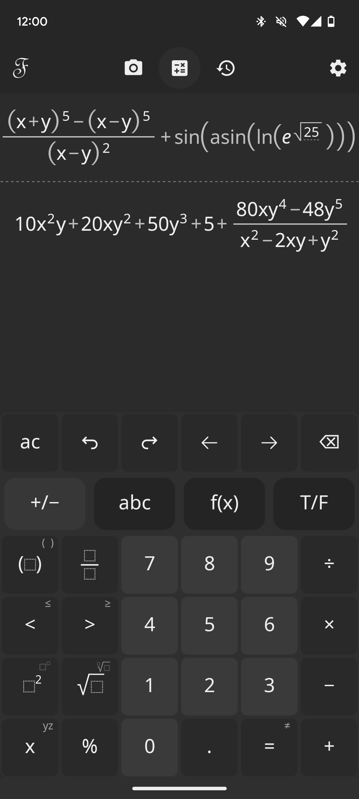

<p align="center">
  
</p>

---

<p align="center">
  <a href="https://play.google.com/store/apps/details?id=com.fintamath">
    
  </a>
</p>

FintamathAndroid is the frontend of [Fintamath](https://github.com/fintarin/Fintamath) library. It is a computer algebra system that supports beautiful input/output of mathematical text and solves many kinds of mathematical problems.

Key features:

- Expression simplification and equation solving
- Wide range of math functions
- Arbitrary precision arithmetic
- High precision approximation
- Complex numbers
- Logic optimization
- Rich display of math expressions
- Copy and paste expressions
- Undo and redo actions
- History of recently entered expressions

<p align="center">
  
</p>

## Supported Platforms

- Android 8.1 or higher
- ABI:
  - arm64-v8a
  - armeabi-v7a
  - x86_64
  - x86

## Build and Run

Clone repository with its submodules.

```bash
git clone --recurse-submodules https://github.com/fintarin/FintamathAndroid
```

And just open the project in AndroidStudio.
